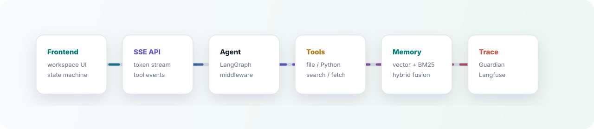

 

## What This Profile Is

I use this page as a compact portfolio for **AI application engineering**: frontend product experience, Agent workflow integration, streaming interfaces, memory/RAG systems, and full-stack delivery.

Instead of showing low-value GitHub activity widgets, this profile focuses on the systems I can actually explain, demo, and improve.

## Featured Systems

<table>
  <tr>
    <td width="50%" valign="top">
      <h3>
        <a href="https://github.com/visenz0122/openclaw-chat-agent-workbench">OpenClaw Chat Agent Workbench</a>
      </h3>
      

        A local-first Agent workbench for streaming chat, tool orchestration, structured memory, Guardian safety checks, and LangGraph-based runtime control.
      

      

        
        
        
        
      

      <ul>
        <li>Streaming chat UI with token and tool-call event rendering</li>
        <li>LangChain/LangGraph Agent runtime with middleware hooks</li>
        <li>Memory v1/v2 design with vector, keyword, and hybrid retrieval</li>
        <li>Inspector-style workspace for prompts, skills, memory, and runtime files</li>
      </ul>
    </td>
    <td width="50%" valign="top">
      <h3>
        <a href="https://github.com/visenz0122/medical-ai-assistant-platform">Medical AI Assistant Platform</a>
      </h3>
      

        A full-stack medical imaging workflow project with AI-assisted inference, role-based pages, research feedback, audit records, and Agent collaboration.
      

      

        
        
        
        
      

      <ul>
        <li>Frontend-heavy role workflows for doctors, researchers, and admins</li>
        <li>Async AI inference states, result review, and failure recovery UI</li>
        <li>Spring Boot, FastAPI, PostgreSQL, and Agent-service integration</li>
        <li>Acceptance docs, demo paths, and verification material organization</li>
      </ul>
    </td>
  </tr>
</table>

## Engineering Signal

| Area | What I Try To Show |
| --- | --- |
| Product-grade frontend | Dense but readable workspaces, responsive state, streaming UI, editor panels, role-based workflows, and interaction details that survive real demos. |
| Agent application engineering | Tool calling, SSE event contracts, memory/RAG injection, LangGraph workflow control, prompt/context handling, and human-in-the-loop boundaries. |
| Full-stack delivery | REST/SSE integration, auth/RBAC coordination, PostgreSQL-backed state, FastAPI services, Docker/local startup paths, and practical debugging. |
| Reliability mindset | Async task states, failure recovery, trace visibility, safety middleware, testable interfaces, and honest project documentation. |

## System Pipeline

## Core Stack

  
  
  
  
  
  

## What I Am Sharpening

- Turning AI demos into usable product workflows with clear state, recovery, and traceability.
- Building frontend surfaces for long-running Agent tasks, tool calls, streaming output, and memory inspection.
- Studying open-source Agent systems so my own projects stay close to real engineering practice.

## Open Source Radar

| Project | Why I Follow It |
| --- | --- |
| [LangGraph](https://github.com/langchain-ai/langgraph) | Stateful Agent orchestration and graph-based workflow control. |
| [Dify](https://github.com/langgenius/dify) | Production-style LLM application and workflow platform design. |
| [OpenHands](https://github.com/OpenHands/OpenHands) | AI software engineering agent patterns and developer-agent UX. |
| [browser-use](https://github.com/browser-use/browser-use) | Browser automation as an Agent capability. |
| [Vercel AI SDK](https://github.com/vercel/ai) | TypeScript-first AI application development patterns. |
| [Langfuse](https://github.com/langfuse/langfuse) | LLM tracing, evaluation, and prompt observability. |
| [Model Context Protocol](https://github.com/modelcontextprotocol) | Tool and data integration standards for Agent applications. |
