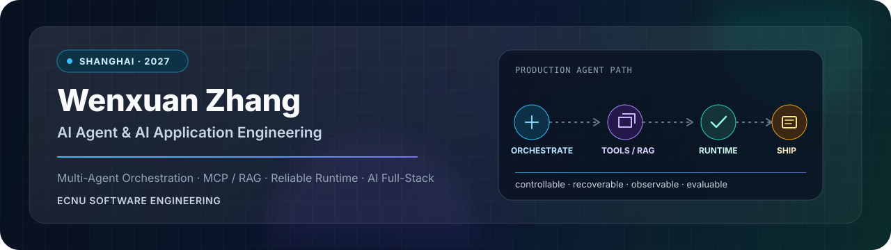

 

<a href="https://github.com/visenz0122">GitHub</a> ·
<a href="mailto:wxzhang0122@gmail.com">wxzhang0122@gmail.com</a> ·
Shanghai · AI application engineering · Agent workflows · Codex tooling

## What I Am Building Toward

I am learning to build AI applications as real engineering systems, not just demos. My current direction is **AI product engineering with Agent workflows**: frontend interaction surfaces, long-running generation tasks, provider adapters, runtime visibility, and delivery habits that make a project easier to test, explain, and maintain.

The projects below are organized by what I am practicing now: AI video production systems, agentic workbenches, full-stack AI workflows, and reusable QA/tooling.

## Current Focus

| Area | What I am studying and making | Public artifact |
| --- | --- | --- |
| AI video production systems | Personal fork work around edit-first generation, storyboard-to-video workflow, async task states, worker/runtime boundaries, and AI provider integration. | [waoowaoo Personal Fork](https://github.com/visenz0122/waoowaoo) |
| Applied full-stack AI workflow | Role-based workflow UI, async inference review, backend service integration, and release/demo material organization. | [Medical AI Assistant Platform](https://github.com/visenz0122/medical-ai-assistant-platform) |
| Agent-assisted QA tooling | Turning vague test requests into specs, browser evidence, Playwright checks, and reviewable reports. | [spec-test.skill](https://github.com/visenz0122/spec-test.skill) |
| Earlier Agent workbench | Streaming Agent UI, tool-call visibility, memory/RAG, safety checks, and observable execution paths. | [OpenClaw Chat Agent Workbench](https://github.com/visenz0122/openclaw-chat-agent-workbench) |

## Main Case Study Now

<table>
  <tr>
    <td width="100%" valign="top">
      <h3>
        <a href="https://github.com/visenz0122/waoowaoo">waoowaoo Personal Fork - AI Video Production Engineering</a>
      </h3>
      

        <strong>Personal fork / portfolio project.</strong> This is my current AI video production engineering case study. I use this fork as my working surface for edit-first generation, Agent-driven creation, task runtime reliability, provider adapters, and full-stack product delivery.
      

      
<strong>What I am practicing</strong>

      <ul>
        <li>Edit-first video generation flow and timeline-oriented creation UX.</li>
        <li>Agent prompt workflow refinement for storyboard, director style, and video generation context.</li>
        <li>Async task lifecycle: submit, poll, worker execution, status events, failure visibility, and frontend refresh.</li>
        <li>Provider-adapter thinking for image/video/voice generation without hiding runtime failures.</li>
        <li>Portfolio-ready documentation that keeps the required source/license notice while focusing on my own engineering practice.</li>
      </ul>
      

        <code>Next.js</code> <code>React</code> <code>TypeScript</code> <code>Prisma</code>
        <code>MySQL</code> <code>Redis</code> <code>BullMQ</code> <code>AI Provider Adapters</code>
        <code>Agent Workflow</code>
      

    </td>
  </tr>
</table>

## Earlier Case Studies

<table>
  <tr>
    <td width="50%" valign="top">
      <h3>
        <a href="https://github.com/visenz0122/medical-ai-assistant-platform">Medical AI Assistant Platform</a>
      </h3>
      

        <strong>Course/team full-stack AI workflow project.</strong> This project helped me practice frontend-heavy AI workflow integration and honest delivery documentation.
      

      
<strong>What it demonstrates</strong>

      <ul>
        <li>Vue 3 role workflows for doctors, researchers, admins, and Agent-assisted operations.</li>
        <li>Async pneumonia inference task states, result review, feedback, and failure recovery UI.</li>
        <li>Integration across Spring Boot business APIs, FastAPI CV inference, FastAPI Agent service, and PostgreSQL.</li>
        <li>Acceptance docs, demo routes, testing notes, and release-readiness material organization.</li>
      </ul>
      

        <code>Vue 3</code> <code>TypeScript</code> <code>Spring Boot</code> <code>FastAPI</code>
        <code>PostgreSQL</code> <code>LangGraph</code> <code>Docker</code> <code>Playwright</code>
      

    </td>
    <td width="50%" valign="top">
      <h3>
        <a href="https://github.com/visenz0122/openclaw-chat-agent-workbench">OpenClaw Chat Agent Workbench</a>
      </h3>
      

        <strong>Earlier personal AI Agent workbench.</strong> I built this as a local-first system for streaming chat, tool orchestration, structured memory, safety checks, and observable Agent execution.
      

      
<strong>What it demonstrates</strong>

      <ul>
        <li>Next.js workspace for chat, session switching, runtime config, file editing, and event inspection.</li>
        <li>FastAPI SSE path from user message to LangChain/LangGraph Agent execution.</li>
        <li>Memory v1/v2 with JSON sessions, Chroma/vector search, PostgreSQL + pgvector, BM25, and hybrid retrieval.</li>
        <li>Guardian middleware and optional Langfuse tracing for safer, inspectable Agent behavior.</li>
      </ul>
      

        <code>Next.js</code> <code>React</code> <code>TypeScript</code> <code>FastAPI</code>
        <code>LangGraph</code> <code>LangChain</code> <code>PostgreSQL</code> <code>pgvector</code>
      

    </td>
  </tr>
</table>

## Developer Tooling

### [spec-test.skill](https://github.com/visenz0122/spec-test.skill)

`spec-test.skill` is my public skill project for agent-assisted web testing. It turns vague "test this feature" requests into structured specifications, test cases, execution evidence, and reviewable QA reports.

| Area | What it contains |
| --- | --- |
| Spec workflow | Cartographer, Inspector, and Operator roles with human review gates. |
| Test design | Boundary value, equivalence partitioning, decision table, state transition, use case, and Right-BICEP references. |
| Execution discipline | Playwright plus browser/screenshot evidence for data, workflow, and visual checks. |
| Reusable artifacts | Chinese and English editions, templates, examples, execution reports, and review checklists. |

## Engineering Signals

| Signal | Evidence across the projects |
| --- | --- |
| Product-grade AI frontend | Streaming chat surfaces, long-running generation states, role workflows, editor panels, result review, and event feedback. |
| Agent integration | SSE contracts, tool-call rendering, memory/RAG injection, LangGraph runtime control, prompt workflow design, and safety checks. |
| Async system thinking | Task submission, worker execution, provider adapters, polling/SSE feedback, failure states, and recovery-oriented UI. |
| Full-stack coordination | REST/SSE APIs, FastAPI services, Spring Boot business logic, PostgreSQL/MySQL records, Redis queues, Docker/local startup paths. |
| Testing and delivery | Specification-based testing, browser evidence, Playwright thinking, acceptance docs, and honest public wording. |

## Stack I Can Discuss From Real Project Work

| Layer | Tools and concepts |
| --- | --- |
| Frontend product surfaces | TypeScript, React, Next.js, Vue 3, Tailwind CSS, Element Plus, editor/workspace UI patterns. |
| Agent / AI application | LangGraph, LangChain, Agent workflow design, SSE streaming, tool calls, memory retrieval, RAG, prompt/context shaping. |
| AI generation runtime | Provider adapters, async queues, worker processes, task events, image/video/voice generation workflow boundaries. |
| Backend / data | FastAPI, Spring Boot, Prisma, PostgreSQL, MySQL, pgvector, Chroma, Redis, Docker Compose, auth/RBAC integration. |
| QA / developer tools | Skill authoring, specification-based testing, browser automation, Playwright, screenshot evidence, test report templates. |

Open source systems I study

| System | Why it matters to my direction |
| --- | --- |
| [LangGraph](https://github.com/langchain-ai/langgraph) | Stateful Agent workflows and controllable execution graphs. |
| [Dify](https://github.com/langgenius/dify) | Production-style LLM workflow and application platform design. |
| [OpenHands](https://github.com/OpenHands/OpenHands) | Developer-agent UX and software engineering Agent patterns. |
| [browser-use](https://github.com/browser-use/browser-use) | Browser automation as an Agent capability. |
| [Vercel AI SDK](https://github.com/vercel/ai) | TypeScript-first streaming AI application patterns. |
| [Langfuse](https://github.com/langfuse/langfuse) | LLM tracing, prompt observability, and evaluation workflows. |

